---
## Front matter
lang: ru-RU
title:  Презентация по лаборатольной работе No.1
subtitle: Операционные системы
author:
  - Джаллох Ишмаил
institute:
  - Российский университет дружбы народов, Москва, Россия
  - Объединённый институт ядерных исследований, Дубна, Россия
date: 02 март 2025

## i18n babel
babel-lang: russian
babel-otherlangs: english

## Formatting pdf
toc: false
toc-title: Содержание
slide_level: 2
aspectratio: 169
section-titles: true
theme: metropolis
header-includes:
 - \metroset{progressbar=frametitle,sectionpage=progressbar,numbering=fraction}
---

## Цель работы

Целью данной работы является приобретение практических навыков установки операционной системы на виртуальную машину, настройки минимально необходимых для дальнейшей работы сервисов.

## Задание

1. Создание виртуальной машины
2. Установка операционной системы
3. Работа с операционной системой после установки
4. Установка программного обеспечения для создания документации
5. Дополнительные задания

# Выполнение лабораторной работы

## Создание виртуальной машины

Virtualbox я устанавливала и настраивала при выполнении лабораторной работы в курсе "Архитектура компьютера и Операционные системы (раздел "Архитектура компьютера")", поэтому сразу открываю окно приложения (рис. @fig:001).

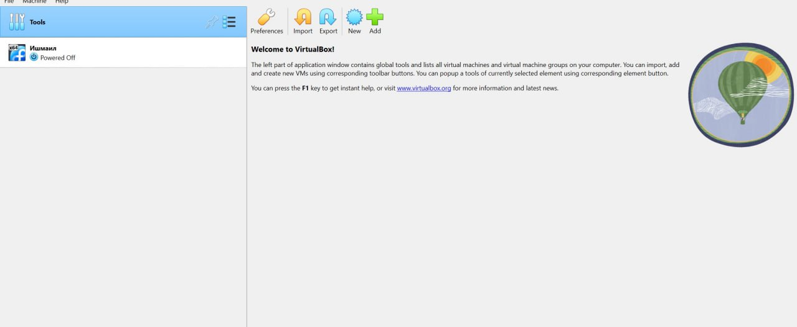{#fig:001 width=70%}

## Создание виртуальной машины

Нажимая "создать", создаю новую виртуальную машину, указываю ее имя, путь к папке машины по умолчанию меня устраивает, выбираю тип ОС и версию (рис. @fig:002).

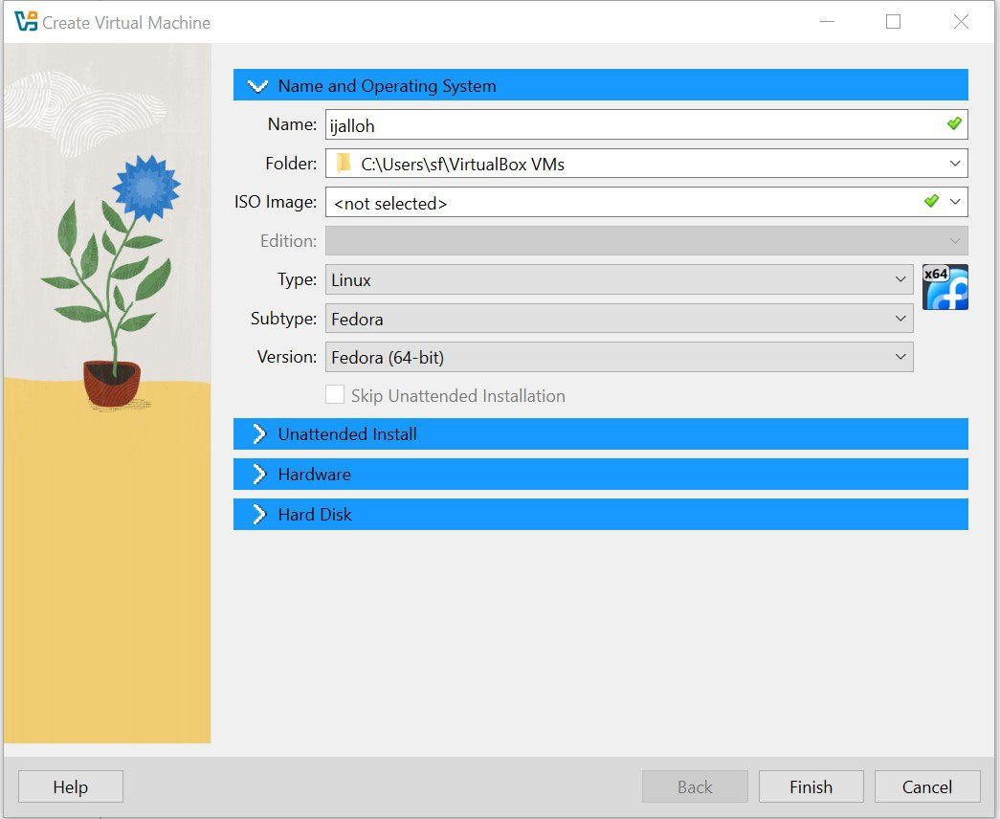{#fig:002 width=70%}

## Создание виртуальной машины

Указываю объем основной памяти виртуальной машины размером 4096МБ (рис. @fig:003).

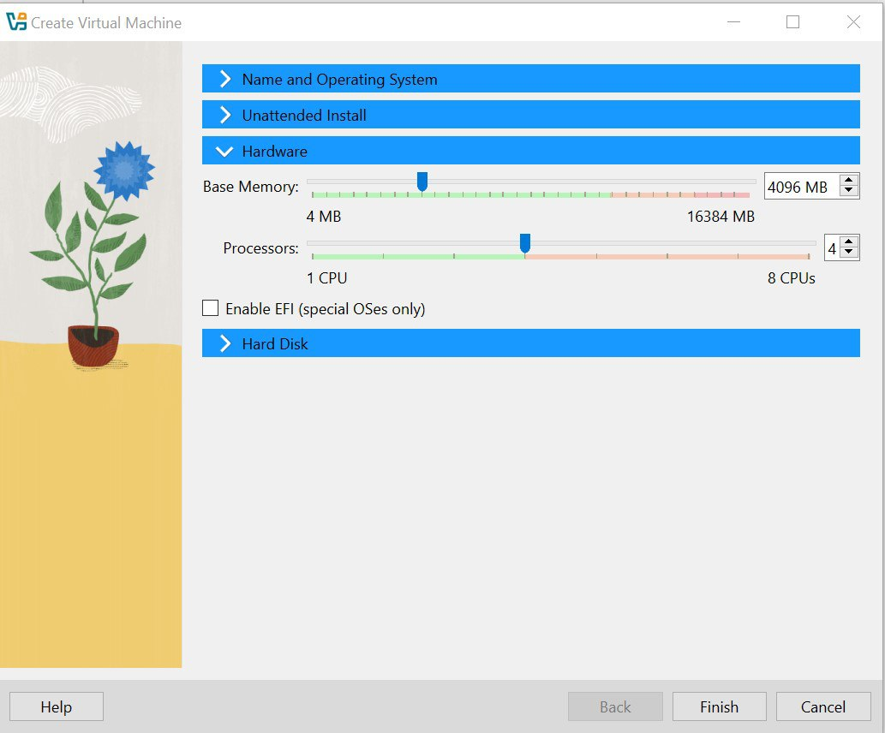{#fig:003 width=70%}

## Создание виртуальной машины

Выбираю в Virtualbox настройку своей виртуальной машины. Перехожу в "Носители", добавляю новый привод привод оптических дисков и выбираю скачанный образ операционной системы Fedora (рис. @fig:004).

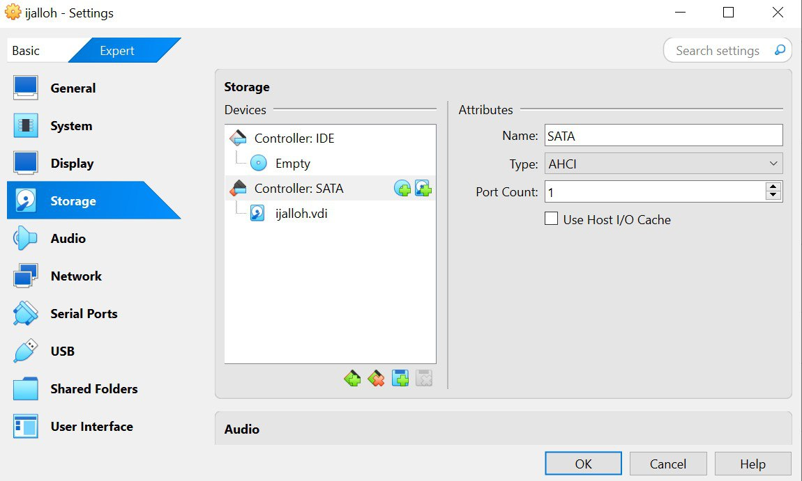{#fig:004 width=70%}

## Создание виртуальной машины

Скачанный образ ОС был успешно выбран (рис. @fig:005).

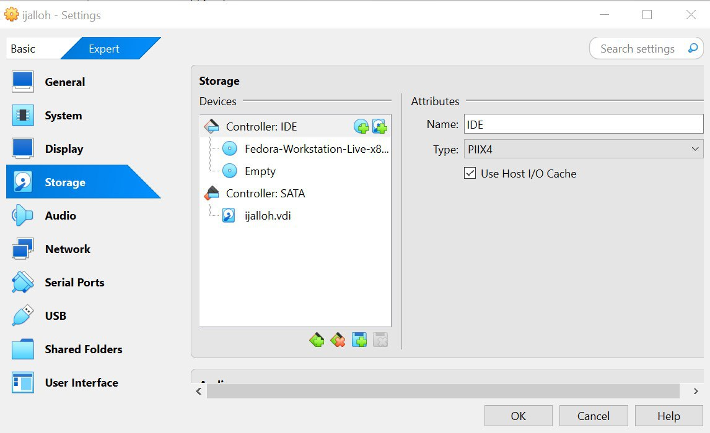{#fig:005 width=70%}

## Установка операционной системы

Чтобы перейти к раскладке окон с табами, нажимаю Win+w. Выбираю язык для использования в процессе установки русски (рис. @fig:006).

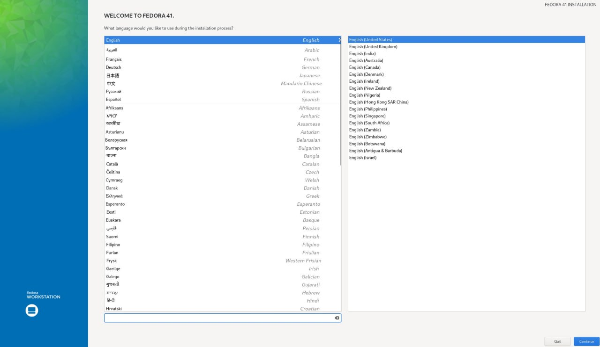{#fig:006 width=70%}

## Установка операционной системы

Раскладку клавиатуры выбираю и русскую, и английскую (рис. @fig:007).

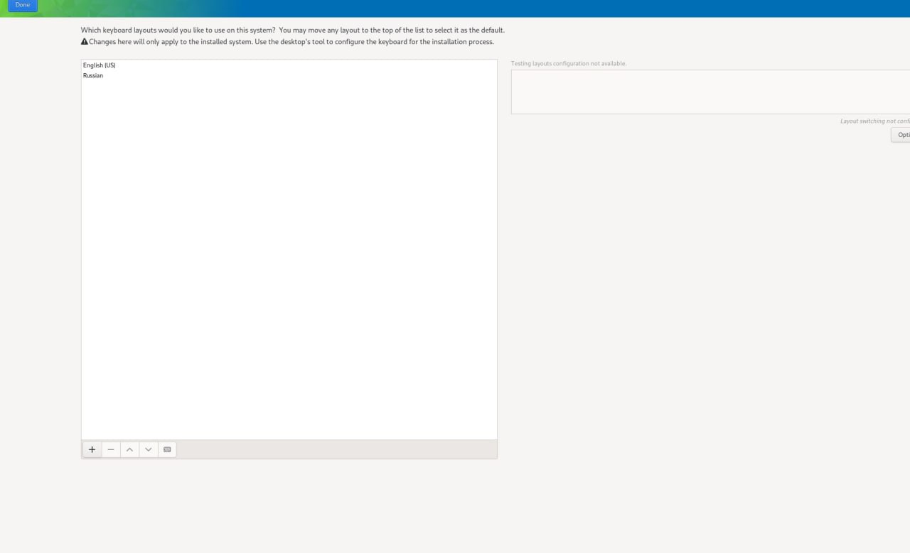{#fig:007 width=70%}

## Установка операционной системы

Далее операционная система устанавливается. После установки нажимаю "завершить установку" (рис. @fig:008).

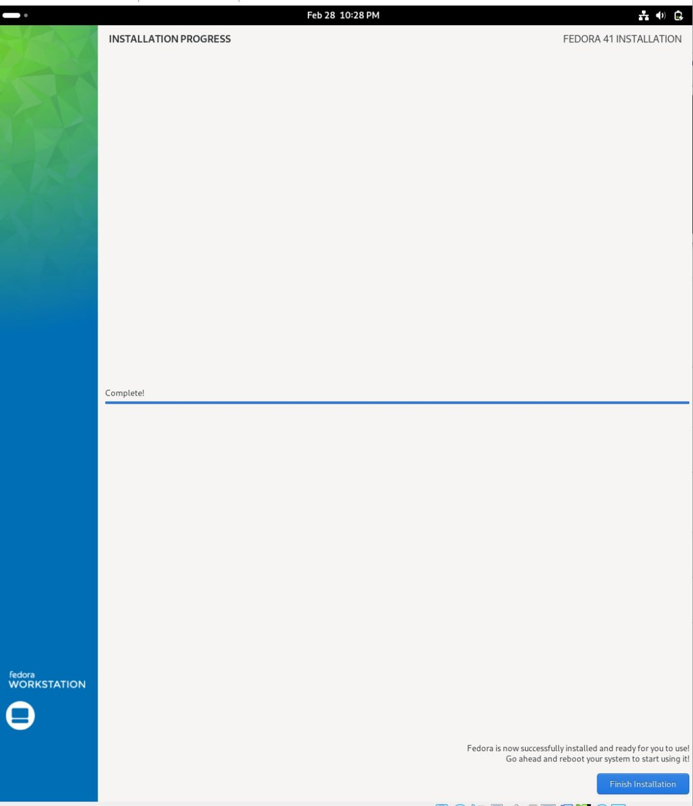{#fig:008 width=70%}

## Работа с операционной системой после установки

Нажимаю Win+Enter для запуска терминала и переключаюсь на роль супер-пользователя(рис. @fig:028).

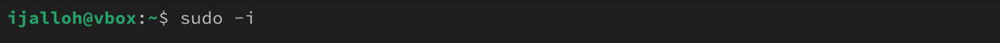{#fig:028 width=70%}

## Работа с операционной системой после установки

Обновляю все пакеты (рис. @fig:029).

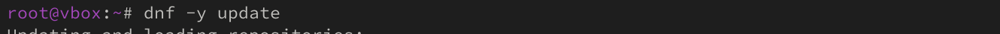{#fig:029 width=70%}

## Работа с операционной системой после установки

Устанавливаю программы для удобства работы в концсоли: tmux для открытия нескольких "вкладок" в одном терминале, mc в качестве файлового менеджера в терминале (рис. @fig:030).

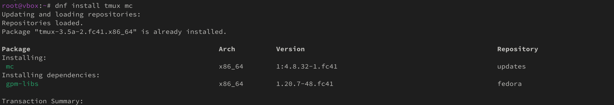{#fig:030 width=70%}

## Работа с операционной системой после установки

Устанавливаю программы для автоматического обновления (рис. @fig:031).

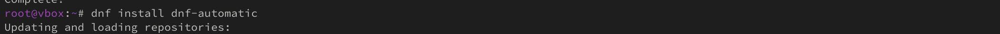{#fig:031 width=70%}

## Работа с операционной системой после установки

Запускаю таймер (рис. @fig:032).

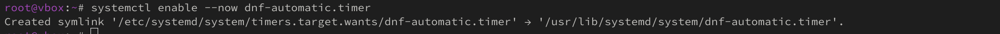{#fig:032 width=70%}

## Работа с операционной системой после установки

Перемещаюсь в директорию /etc/selinux, открываю md, ищу нужный файл (рис. @fig:033).

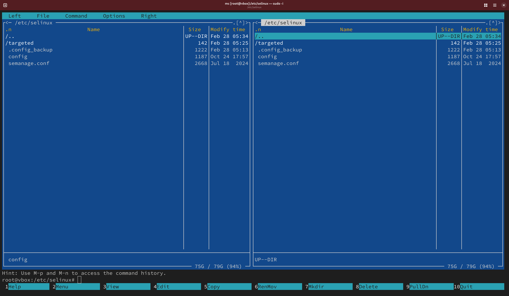{#fig:033 width=70%}

## Работа с операционной системой после установки

Изменяю открытый файл: SELINUX=enforcing меняю на значение SELINUX=permissive (рис. @fig:034).

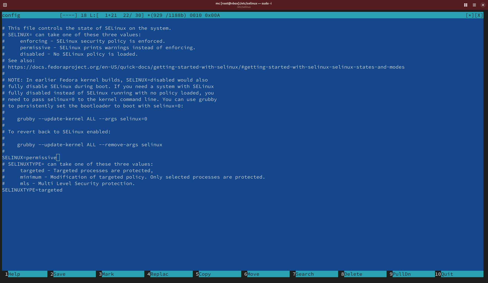{#fig:034 width=70%}

## Работа с операционной системой после установки

Перезагружаю виртуальную машину (рис. @fig:037).

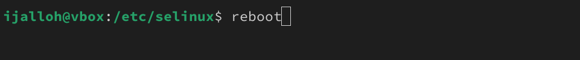{#fig:037 width=70%}

## Работа с операционной системой после установки

Снова вхожу в ОС, снова запускаю терминал, запускюа терминальный мультиплексор (рис. @fig:038).

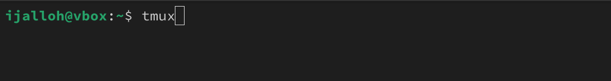{#fig:038 width=70%}

## Работа с операционной системой после установки

Переключаюсь на роль супер-пользователя (рис. @fig:039).

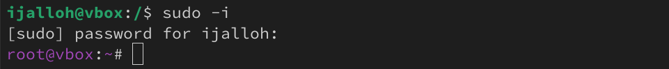{#fig:039 width=70%}

## Работа с операционной системой после установки

Устанавливаю пакет dkms (рис. @fig:0340).

{#fig:040 width=70%}

## Работа с операционной системой после установки

В меню виртуальной машины подключаю образ диска гостевой ОС и примонтирую диск с помощью утилиты mount (рис. @fig:041).

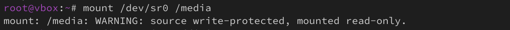{#fig:041 width=70%}

## Работа с операционной системой после установки

Устанавливаю драйвера (рис. @fig:042).

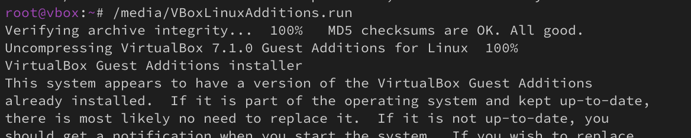{#fig:042 width=70%}

## Работа с операционной системой после установки

Перезагружаю виртуальную машину (рис. @fig:043).

{#fig:043 width=70%}

## Работа с операционной системой после установки

Перехожу в директорию /tc/X11/xorg.conf.d, открываю mc для удобства, открываю файл 00-keyboard.conf (рис. @fig:044).

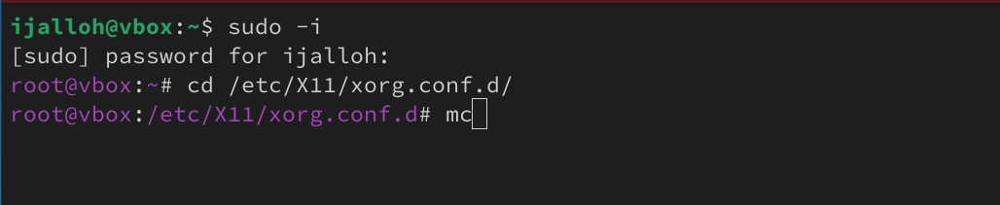{#fig:044 width=70%}

## Работа с операционной системой после установки

Редактирую конфигурационный файл (рис. @fig:045).

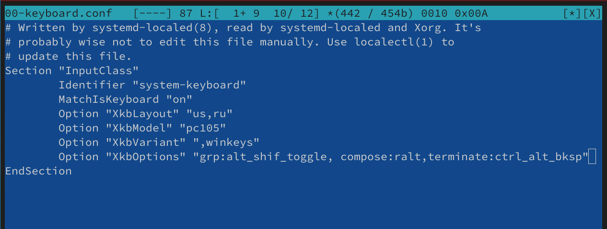{#fig:045 width=70%}

## Работа с операционной системой после установки

Перезагружаю виртуальную машину (рис. @fig:046).

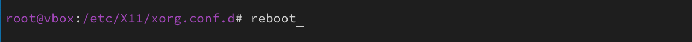{#fig:046 width=70%}

## Установка программного обеспечения для создания документации

Запускаю терминал. Запускаю терминальный мультиплексор tmux, переключаюсь на роль супер-пользователя (рис. @fig:047).

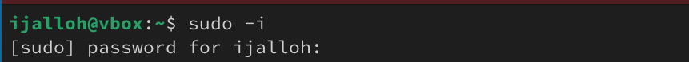{#fig:047 width=70%}

## Установка программного обеспечения для создания документации

Устанавливаю pandoc с помощью утилиты dnf и флага -y, который автоматически на все вопросы системы отчевает "yes" (рис. @fig:048).

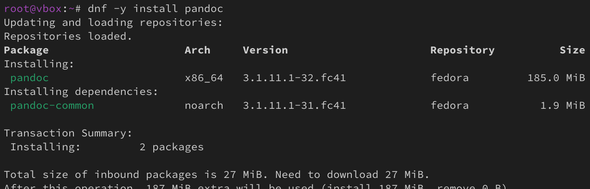{#fig:048 width=70%}

## Установка программного обеспечения для создания документации

Устанавливаю необходимые расширения для pandoc (рис. @fig:049).

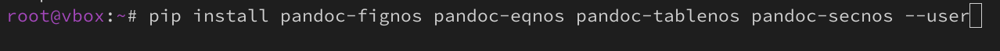{#fig:049 width=70%}

## Установка программного обеспечения для создания документации

Устанавливаю дистрибутив texlive (рис. @fig:051).

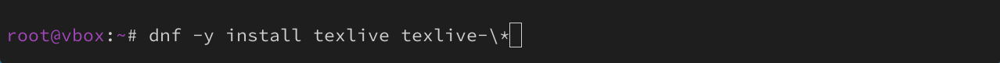{#fig:051 width=70%}

## Выводы

При выполнении данной лабораторной работы я приобрела практические навыки установки операционной системы на виртуальную машину, а так же сделала настройки минимально необходимых для дальнейшей работы сервисов.

## Выполнение дополнительного задания

Ввожу в терминале команду dmesg, чтобы проанализировать последовательность загрузки системы (рис. @fig:053).

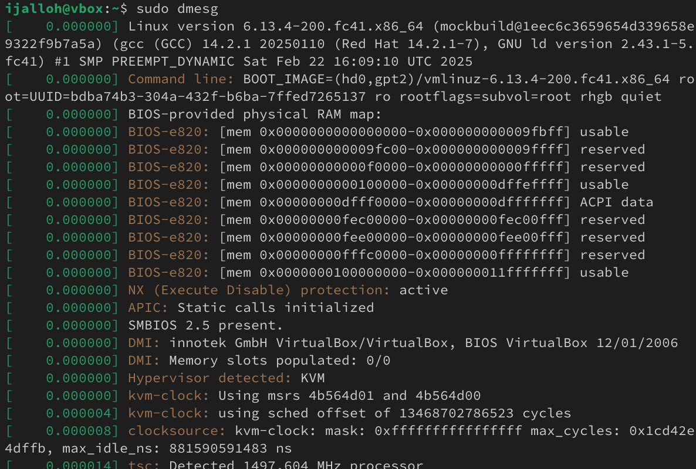{#fig:053 width=70%}

## Выполнение дополнительного задания

С помощью поиска, осуществляемого командой 'dmesg | grep -i <что ищем>', ищу версию ядра Linux: 6.1.10-200.fc37.x86_64 (рис. @fig:054).

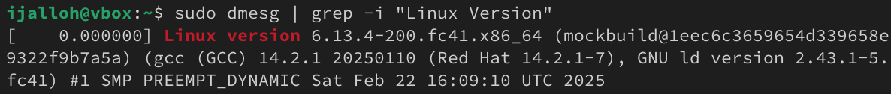{#fig:054 width=70%}

## Выполнение дополнительного задания

К сожалению, если вводить "Detected Mhz processor" там, где нужно указывать, что я ищу, то мне ничего не выведется. Это происходит потому, что запрос не предусматривает дополнительные символы внутри него (я проверяла, будет ли работать он с маской - не будет). В таком случае я оставила одно из ключевых слов (могла оставить два: "Mhz processor") и получила результат: 1992 Mhz (рис. @fig:055).

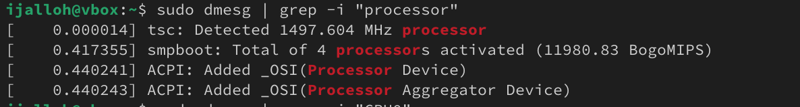{#fig:055 width=70%}

## Выполнение дополнительного задания

Аналогично ищу модель процессора (рис. @fig:056).

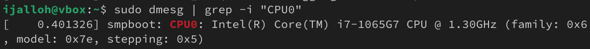{#fig:056 width=70%}

## Выполнение дополнительного задания

Объем доступной оперативной памяти ищу аналогично поиску частоты процессора, т. к. возникла та же проблема, что и там (рис. @fig:057).

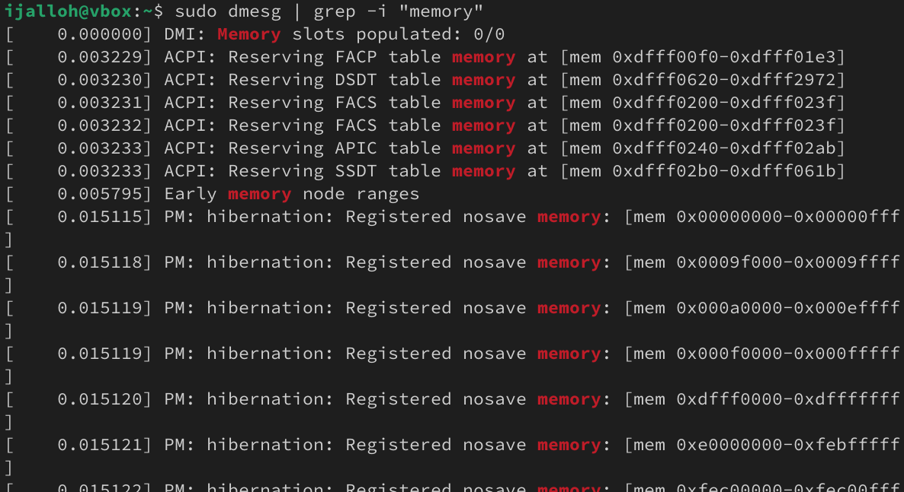{#fig:057 width=70%}

## Выполнение дополнительного задания

Нахожу тип обнаруженного гипервизора (рис. @fig:058).

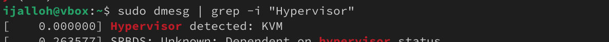{#fig:058 width=70%}

## Выполнение дополнительного задания

Последовательность монтирования файловых систем можно посмотреть, введя в поиск по результату dmesg слово mount (рис. @fig:060).

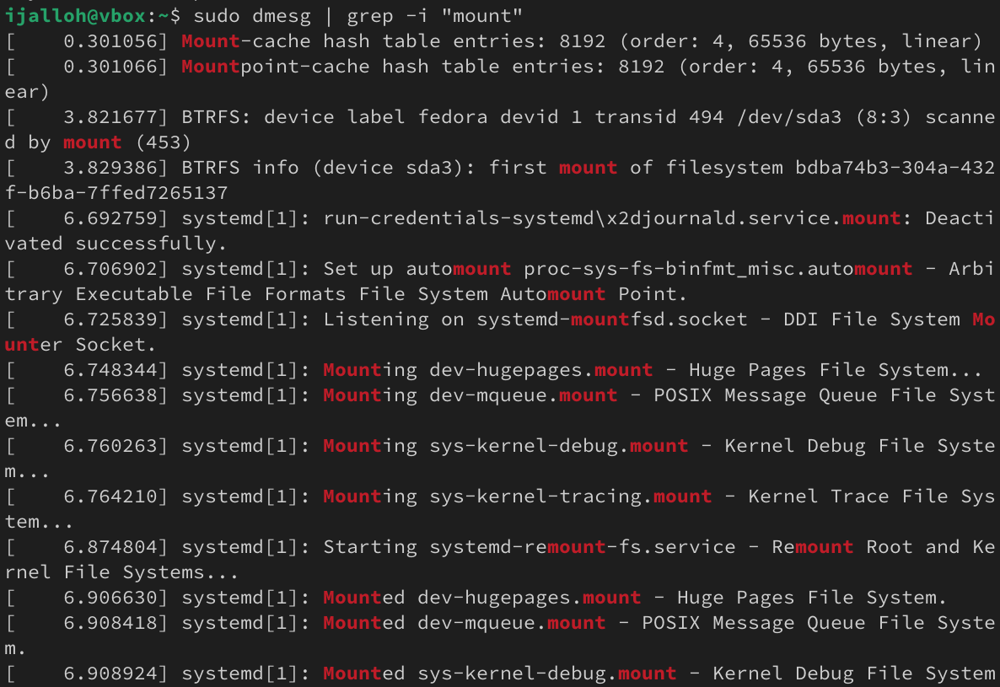{#fig:060 width=70%}
