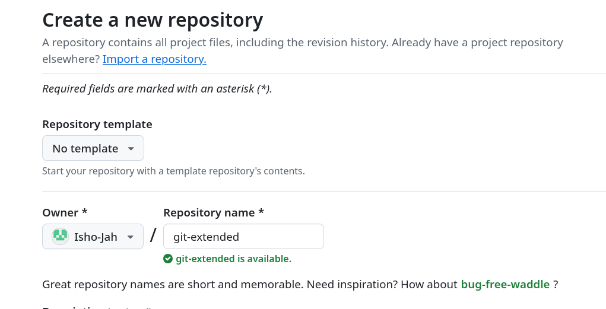
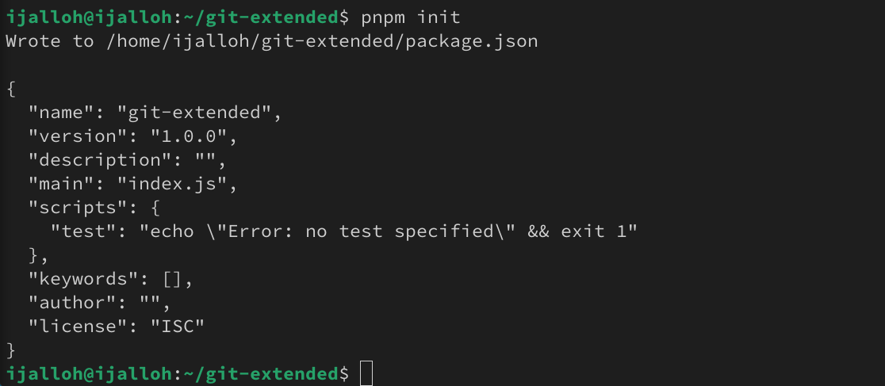
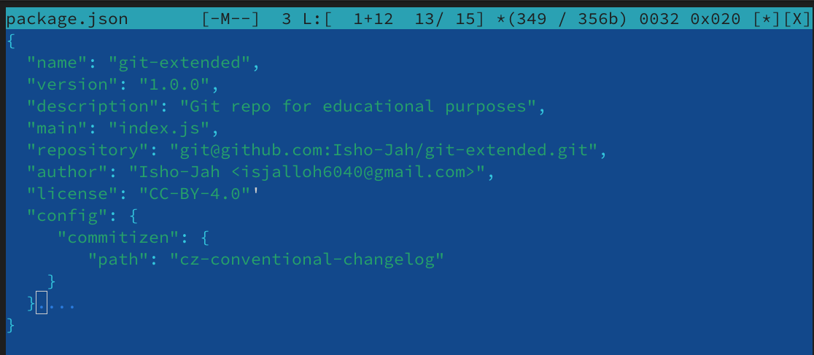
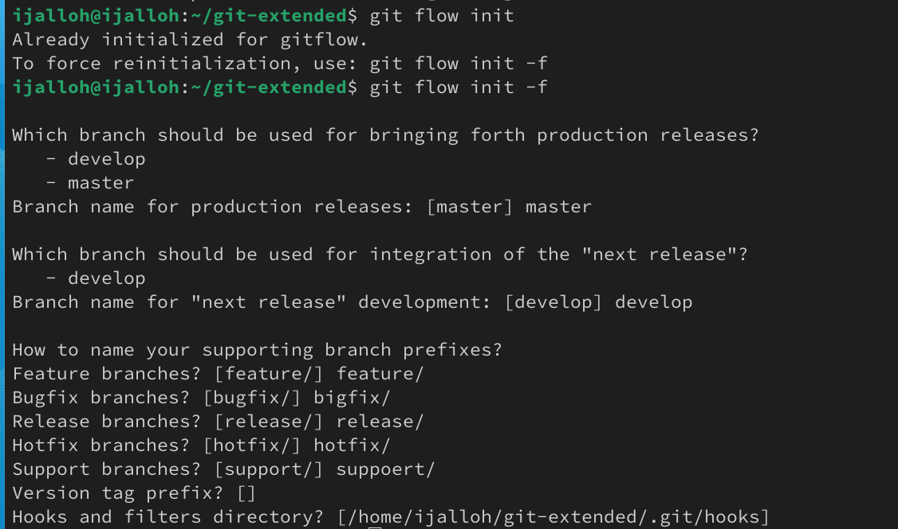
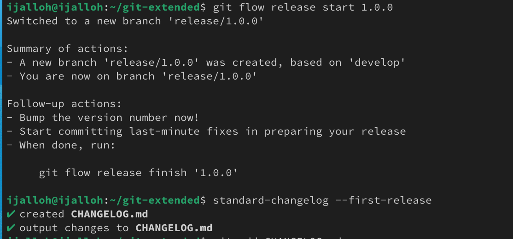
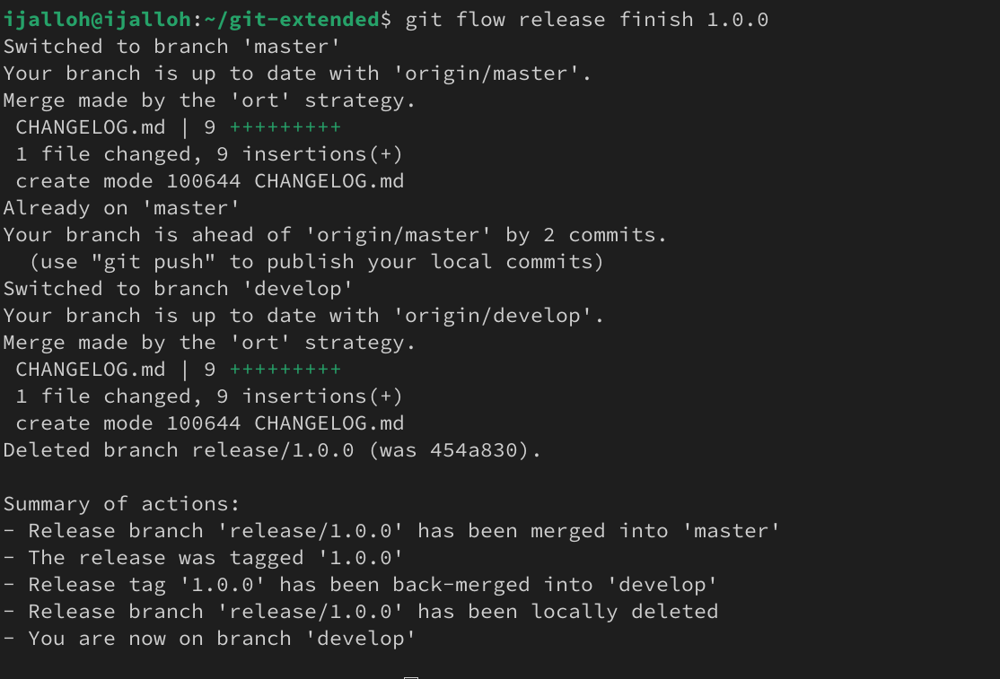
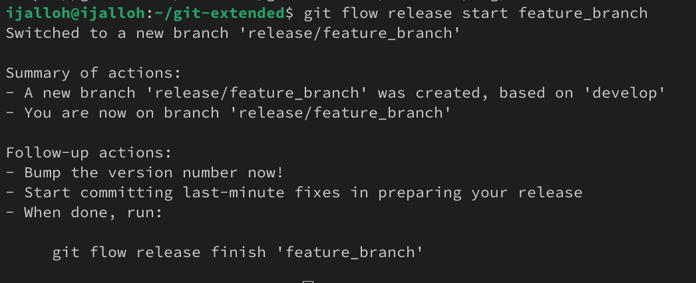
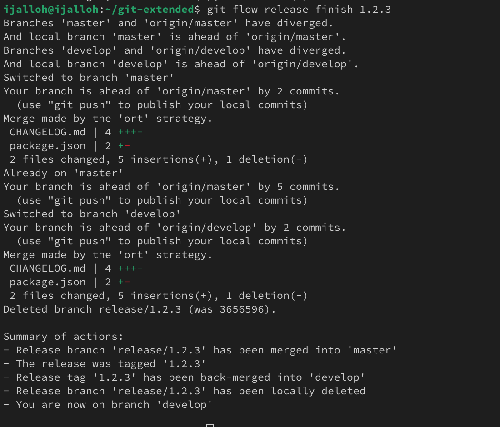

---
## Front matter
title: "Отчёт по лабораторной работе №4"
subtitle: "Дисциплина: Архитектура компьютеров и операционные системы"
author: "Джаллох Ишмаил"

## Generic otions
lang: ru-RU
toc-title: "Содержание"

## Bibliography
bibliography: bib/cite.bib
csl: pandoc/csl/gost-r-7-0-5-2008-numeric.csl

## Pdf output format
toc: true # Table of contents
toc-depth: 2
lof: true # List of figures
fontsize: 12pt
linestretch: 1.5
papersize: a4
documentclass: scrreprt
## I18n polyglossia
polyglossia-lang:
  name: russian
  options:
	- spelling=modern
	- babelshorthands=true
polyglossia-otherlangs:
  name: english
## I18n babel
babel-lang: russian
babel-otherlangs: english
## Fonts
mainfont: PT Serif
romanfont: PT Serif
sansfont: PT Sans
monofont: PT Mono
mainfontoptions: Ligatures=TeX
romanfontoptions: Ligatures=TeX
sansfontoptions: Ligatures=TeX,Scale=MatchLowercase
monofontoptions: Scale=MatchLowercase,Scale=0.9
## Biblatex
biblatex: true
biblio-style: "gost-numeric"
biblatexoptions:
  - parentracker=true
  - backend=biber
  - hyperref=auto
  - language=auto
  - autolang=other*
  - citestyle=gost-numeric
## Pandoc-crossref LaTeX customization
figureTitle: "Рис."
listingTitle: "Листинг"
lofTitle: "Список иллюстраций"
lolTitle: "Листинги"
## Misc options
indent: true
header-includes:
  - \usepackage{indentfirst}
  - \usepackage{float} # keep figures where there are in the text
  - \floatplacement{figure}{H} # keep figures where there are in the text
---

# Цель работы

Цель данной работы является получением навыков правильной работы с репозиториями git.

# Задание

1. Выполнить работу для тестового репозитория.
2. Преобразовать рабочий репозиторий в репозиторий с git-flow и conventional commits.

# Выполнение лабораторной работы

## Установка git-flow

Gitflow Workflow предполагает выстраивание строгой модели ветвления с учётом выпуска проекта. Сначала я включаю репозиторий copr:

{#fig:001 width=60%}

Используя dnf install скачаю gitflow:

{#fig:002 width=60%}

## Установка Node.js

Для семантического версионирования и общепринятых коммитов я устанавливаю Nodejs и pnpm:

{#fig:003 width=60%}

{#fig:004 width=60%}

## Настройка Node.js

Запуская pnpm setup я добавляю каталог с исполняемыми файлами, устанавливаемыми yarn для работы с Node.js в переменную PATH:

{#fig:005 width=60%}

Далее перелогинуюсь и выполняю source ~/.bashrc:

{#fig:006 width=60%}

## Общепринятые коммиты

Для помощи в форматировании коммитов добавляю программу commitizen:

{#fig:007 width=60%}

Добавляю standard-changelog для помощи в создании логов:

{#fig:008 width=60%}

Создаю репозиторий на GitHub назову его git-extended:

{#fig:009 width=60%}

Я клонирую его в каталог git-extended:

{#fig:0010 width=60%}

Создаю и добавляю файл README.md: 

{#fig:0011 width=60%}

Делаю первый коммит и выкладываю на github:

{#fig:0012 width=60%}

Я инициализирую pnpm:

{#fig:0013 width=60%}

Заполняю несколько параметров пакета (файл package.json):

{#fig:0014 width=60%}

Добавляю новые файлы и выполняю коммит (указиваю тип коммит (feat)) и отправляю на гит:

{#fig:0015 width=60%}

Инициализирую git-flow и указываю ветки:

{#fig:0016 width=60%}

Преверяю что я на ветке develop с промощью git branch:

{#fig:0017 width=60%}

Загружаю весь репозиторий в хранилище с помощью git push --all:

{#fig:0018 width=60%}

Установливаю внешнюю ветку как вышестоящую для этой ветки (develop):

{#fig:0019 width=60%}

Создаю релиз с версией 1.0.0 и журнал изменений (standard-changelog)::

{#fig:0020 width=60%}

Добавляю журнал изменений в индекс:

{#fig:0021 width=60%}

Залью релизную ветку в основную ветку:

{#fig:0032 width=60%}

Отправляю данные на github:

{#fig:0022 width=60%}

Создаю релиз на github. Для этого использую утилиты работы с github gh (gh release create):

{#fig:0023 width=60%}

Создаю ветку для новой функциональности:

{#fig:0024 width=60%}

Далее, продолжаю работу c git как обычно. Создаю релиз с версией 1.2.3:

{#fig:0025 width=60%}

Обновляю номер версии в файле package.json в 1.2.3:

{#fig:0026 width=60%}

Создаю журнал изменений (standard-changelog):

{#fig:0027 width=60%}

Добавляю журнал изменений в индекс:

{#fig:0028 width=60%}

Залью релизную ветку в основную ветку:

{#fig:0029 width=60%}

Отправляю данные на github:

{#fig:0030 width=60%}

Создаю релиз на github с комментарием из журнала изменений:

{#fig:0031 width=60%}

# Выводы

При выполнение работы я получила навыки правильной работы с репозиториями git.

# Список литературы{.unnumbered}

[Архитектура ЭВМ](https://esystem.rudn.ru/mod/page/view.php?id=1098794&forceview=1)
