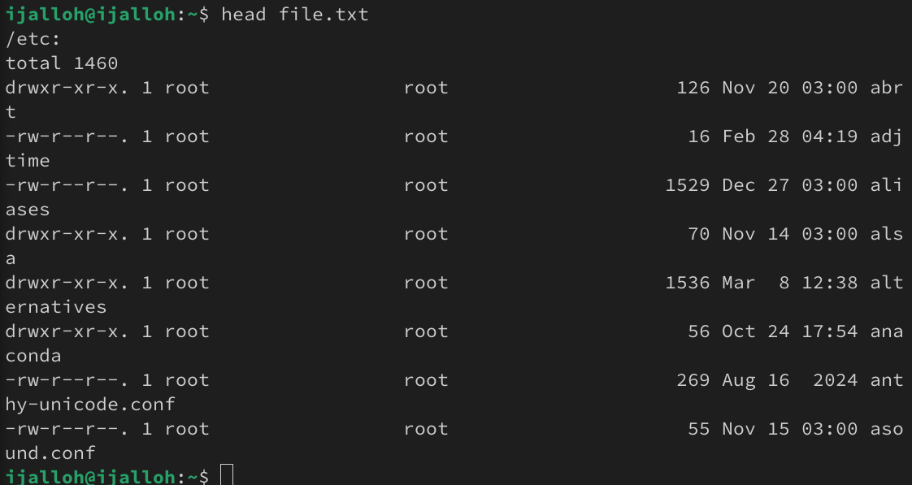
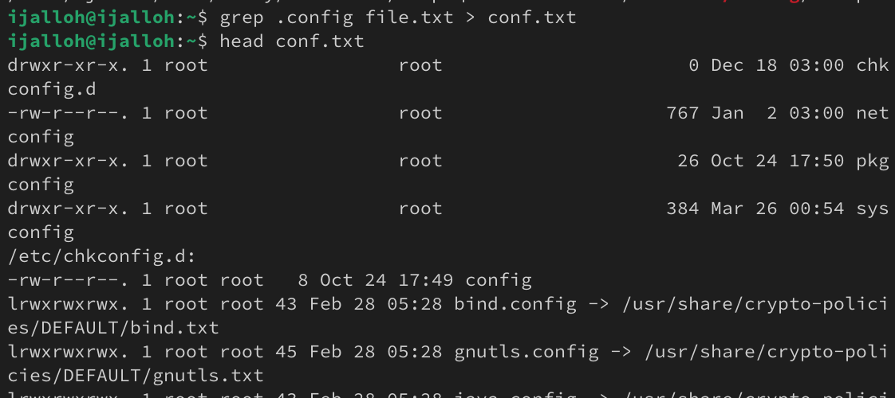
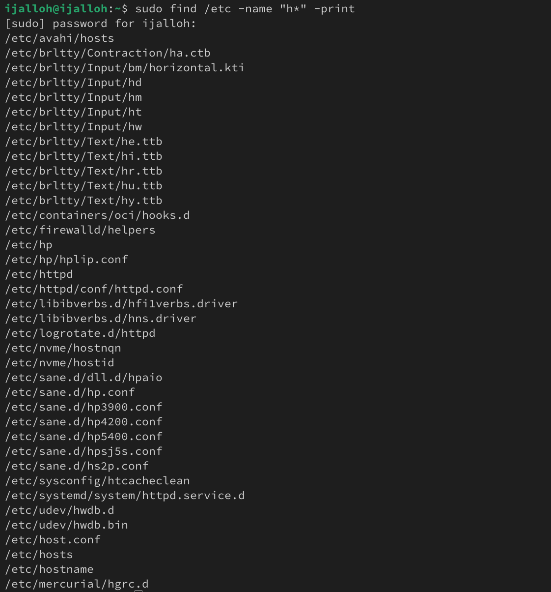
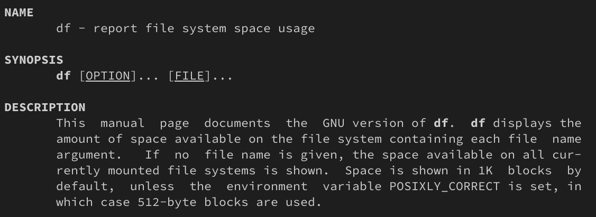

---
## Front matter
title: "Отчёт по лабораторной работе №8"
subtitle: "Поиск файлов. Перенаправление ввода-вывода. Просмотр запущенных процессов"
author: "Джаллох Ишмаил"

## Generic otions
lang: ru-RU
toc-title: "Содержание"

## Bibliography
bibliography: bib/cite.bib
csl: pandoc/csl/gost-r-7-0-5-2008-numeric.csl

## Pdf output format
toc: true # Table of contents
toc-depth: 2
lof: true # List of figures
lot: true # List of tables
fontsize: 12pt
linestretch: 1.5
papersize: a4
documentclass: scrreprt
## I18n polyglossia
polyglossia-lang:
  name: russian
  options:
	- spelling=modern
	- babelshorthands=true
polyglossia-otherlangs:
  name: english
## I18n babel
babel-lang: russian
babel-otherlangs: english
## Fonts
mainfont: PT Serif
romanfont: PT Serif
sansfont: PT Sans
monofont: PT Mono
mainfontoptions: Ligatures=TeX
romanfontoptions: Ligatures=TeX
sansfontoptions: Ligatures=TeX,Scale=MatchLowercase
monofontoptions: Scale=MatchLowercase,Scale=0.9
## Biblatex
biblatex: true
biblio-style: "gost-numeric"
biblatexoptions:
  - parentracker=true
  - backend=biber
  - hyperref=auto
  - language=auto
  - autolang=other*
  - citestyle=gost-numeric
## Pandoc-crossref LaTeX customization
figureTitle: "Рис."
tableTitle: "Таблица"
listingTitle: "Листинг"
lofTitle: "Список иллюстраций"
lotTitle: "Список таблиц"
lolTitle: "Листинги"
## Misc options
indent: true
header-includes:
  - \usepackage{indentfirst}
  - \usepackage{float} # keep figures where there are in the text
  - \floatplacement{figure}{H} # keep figures where there are in the text
---

# Цель работы

Ознакомление с инструментами поиска файлов и фильтрации текстовых данных. Приобретение практических навыков: по управлению процессами (и заданиями), по проверке использования диска и обслуживанию файловых систем.

# Задание

1. Осуществите вход в систему, используя соответствующее имя пользователя.
2. Запишите в файл file.txt названия файлов, содержащихся в каталоге /etc. Допи- шите в этот же файл названия файлов, содержащихся в вашем домашнем каталоге.
3. Выведите имена всех файлов из file.txt, имеющих расширение .conf, после чего запишите их в новый текстовой файл conf.txt.
4. Определите, какие файлы в вашем домашнем каталоге имеют имена, начинавшиеся с символа c? Предложите несколько вариантов, как это сделать.
5. Выведите на экран (по странично) имена файлов из каталога /etc, начинающиеся с символа h.
6. Запустите в фоновом режиме процесс, который будет записывать в файл ~/logfile файлы, имена которых начинаются с log.
7. Удалите файл ~/logfile.
8. Запустите из консоли в фоновом режиме редактор gedit.
9. Определите идентификатор процесса gedit, используя команду ps, конвейер и фильтр grep. Как ещё можно определить идентификатор процесса?
10. Прочтите справку (man) команды kill, после чего используйте её для завершения процесса gedit.
11. Выполните команды df и du, предварительно получив более подробную информацию об этих командах, с помощью команды man.
12. Воспользовавшись справкой команды find, выведите имена всех директорий, имею- щихся в вашем домашнем каталоге.

# Выполнение лабораторной работы

Вошел в систему под моем имением, открыл терминал и записал в файле file.txt названия файлов, содержащихся в каталоге /etc с помощью ls -lR /etc > file.txt :

{#fig:001 width=70%}

С помощью head я проверяю ,что в файл записался названия файлов, содержащихся в каталоге /etc:

{#fig:002 width=70%}

В file.txt добавляю названия файлов, из домашнего каталога используя ls -lR /etc >> file.txt:

{#fig:003 width=70%}

Вывожу имена всех файлов из file.txt, имеющих расширение .conf с помощью grep: 

{#fig:004 width=70%}

Затем запишиу их в новый текстовой файл conf.txt (grep .conf file.txt > conf.txt) и проверяю с помощью head:

{#fig:005 width=70%}

Чтобы определить, какие файлы в домашнем каталоге имеют имена, начинавшиеся с символа "c", использую find ~ -name "c*" print ; ~ обозначается домашний каталог, -name (имя файлов) "с *" строка символов, определяющая имя файла и print выводит результаты на экране:

{#fig:006 width=70%}

Также можно это действие выполнить используя ls -lR | grep "c*"

{#fig:007 width=70%}

с помощью find /etc -name "h*" -print, вывожу файлы из каталога /etc, начинающиеся с символа h:

{#fig:008 width=70%}

В фоновом режиме запускаю процесс, который будет записывать в файл ~/logfile файлы, имена которых начинаются с log:

{#fig:009 width=70%}

Удаляю созданный logfile и проверяю:

{#fig:0010 width=70%}

Запускаю из консоли в фоновом режиме редактор gedit указывая &:

{#fig:0011 width=70%}

Используя команду ps, конвейер и фильтр grep, определяю идентификатор процесса gedit (3576):

{#fig:0013 width=70%}

{#fig:0014 width=70%}

С помощью man прочитала справку команды kill и использую её для завершения процесса gedit:

{#fig:0015 width=70%}

С помощью man прочитала справку команд df и du:

{#fig:0016 width=70%}

{#fig:0017 width=70%}

Используя df -vi я вывожу информацию об инодах и вижу сколько свободного места у моей системы:

{#fig:0018 width=70%}

Используя du -a вижу сколько места занимают файлы в директории Загрузки:

{#fig:0019 width=70%}

Воспользовавшись справкой команды find и аргумент d, вывожу всех директорий, имеющихся в домашнем каталоге:

{#fig:0020 width=70%}

{#fig:0021 width=70%}

# Выводы

При выполнение данной работы я ознакомился с инструментами поиска файлов и фильтрации текстовых данных. Также приобрел практические навыки по управлению процессами и по проверке использования диска по обслуживанию файловых систем.

# Ответы на контрольные вопросы

1. stdin — стандартный поток ввода (по умолчанию: клавиатура), файловый дескриптор 0; stdout — стандартный поток вывода (по умолчанию: консоль), файловый дескриптор 1; stderr — стандартный поток вывод сообщений об ошибках (по умолчанию: консоль), файловый дескриптор 2

2. > - Перенаправление вывода (stdout) в файл "filename", >> файл открывается в режиме добавления.

3. Конвейер (pipe) служит для объединения простых команд или утилит в цепочки, в которых результат работы предыдущей команды передаётся последующей.

4. Программа - это набор инструкций, который позволяет ЦПУ выполнять определенную задачу, в то время как процесс - это исполняемая программа.

5. PPID - (parent process ID) идентификатор родительского процесса. Процесс может порождать и другие процессы. UID, GID - реальные идентификаторы пользователя и его группы, запустившего данный процесс.

6. Запущенные фоном программы называются задачами (jobs). Ими можно управлять с помощью команды jobs, которая выводит список запущенных в данный момент задач.

7. Команда htop похожа на команду top по выполняемой функции: они обе показывают информацию о процессах в реальном времени, выводят данные о потреблении системных ресурсов и позволяют искать, останавливать и управлять процессами. У обеих команд есть свои преимущества. Например, в программе htop реализован очень удобный поиск по процессам, а также их фильтрация. В команде top это не так удобно — нужно знать кнопку для вывода функции поиска.

8. Команда find - это команда для поиска файлов и каталогов на основе специальных условий. Ее можно использовать в различных обстоятельствах, например, для поиска файлов по разрешениям, группам, типу, размеру и другим подобным критериям. Утилита find предустановлена по умолчанию во всех Linux дистрибутивах. Команда find имеет такой синтаксис: find [папка] [параметры] критерий шаблон [действие] Пример: find /etc -name "p*" -print

9. find / -type f -exec grep -H 'текстДляПоиска' {} ;

10. df -h.

11. du -s.

12. kill% номер задачи.
