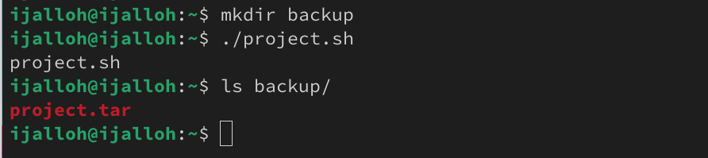
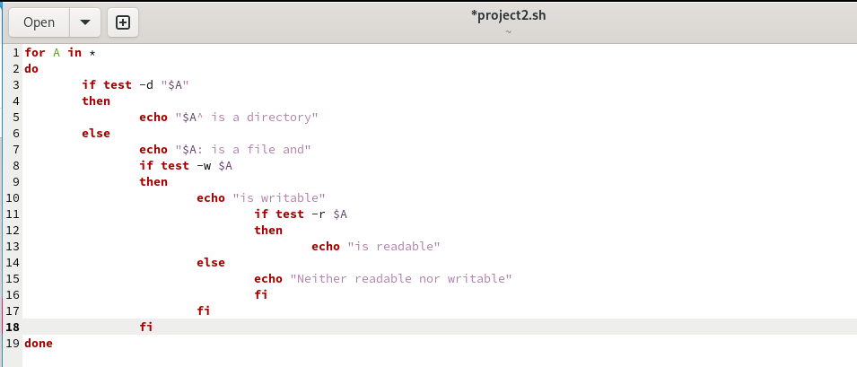
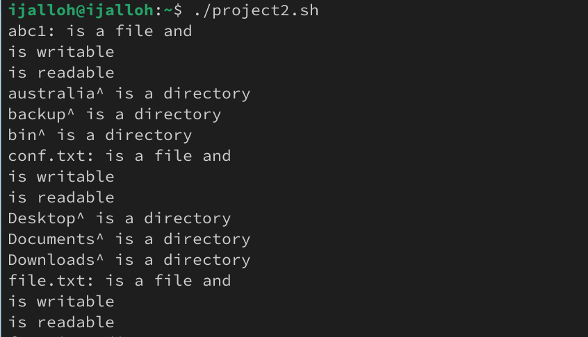

---
## Front matter
lang: ru-RU
title: Презентация по лабораторной работе №12
subtitle: Программирование в командном процессоре ОС UNIX. Командные файлы
author:
  - Джаллох Ишмаил.
institute:
  - Российский университет дружбы народов, Москва, Россия
date: 02 мая 2025

## i18n babel
babel-lang: russian
babel-otherlangs: english

## Formatting pdf
toc: false
toc-title: Содержание
slide_level: 2
aspectratio: 169
section-titles: true
theme: metropolis
header-includes:
 - \metroset{progressbar=frametitle,sectionpage=progressbar,numbering=fraction}
 - '\makeatletter'
 - '\beamer@ignorenonframefalse'
 - '\makeatother'
---

# Информация

## Докладчик

:::::::::::::: {.columns align=center}
::: {.column width="70%"}

  * Джаллох Ишмаил
  * Группа НКА 05-24
  * Факультет физико математических и естественных наук
  * Российский университет дружбы народов
  * [1032239614@rudn.ru](mailto:1032239614@rudn.ru)
  * <https://Isho-Jah.github.io/ru/>

:::
::::::::::::::

# Вводная часть

## Цели и задачи

Цель данной работы - научиться писать небольшие командные файлы.

### Задачи

1. Написать скрипт, который при запуске будет делать резервную копию самого себя в другую директорию
2. Написать пример командного файла, обрабатывающего любое произвольное число аргументов командной строки
3. Написать командный файл — аналог команды ls
4. Написать командный файл, который получает в качестве аргумента командной строки формат файла и вычисляет количество таких файлов в указанной директории.

## Выполнение работы

Я создал файл project.sh. В этом файле я написал скрипт ,который при запуске будет делать резервную копию самого себя (то есть файла, в котором содержится его исходный код) в другую директорию backup в домашнем каталоге.

```
tar -cvf ~/backup/project.tar project.sh
```
{#fig:004 width=50%}

## Выполнение работы

В другом файле project1.sh, написал код, обрабатывающий любое произвольное число аргументов командной строки.

```
for A in $*
	do echo $A
done
```

## Выполнение работы

{#fig:0010 width=50%}

## Выполнение работы

{#fig:0011 width=50%}

## Выполнение работы

Создал файл project3.sh и в нем написал код, который получает в качестве аргумента командной строки формат файла (.txt, .doc, .jpg, .pdf и т.д.) и вычисляет количество таких файлов в указанной директории.

```
echo "Enter file format: "
read format
echo "Enter directory: "
read directory 
find "${directory}" -name ".${format}" -type f | wc -l
```

# Выводы

При выполнении данной работы я научился писать небольшие командные файлы.
