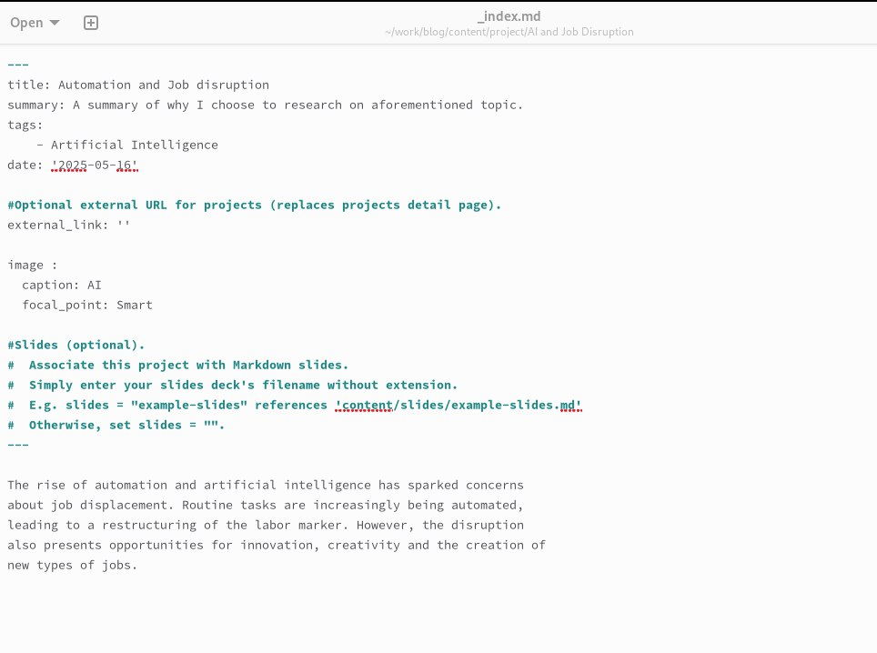
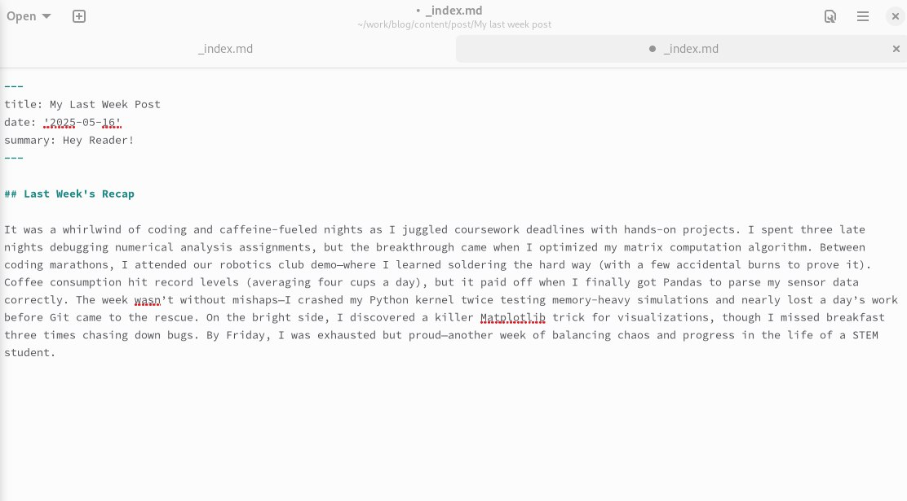
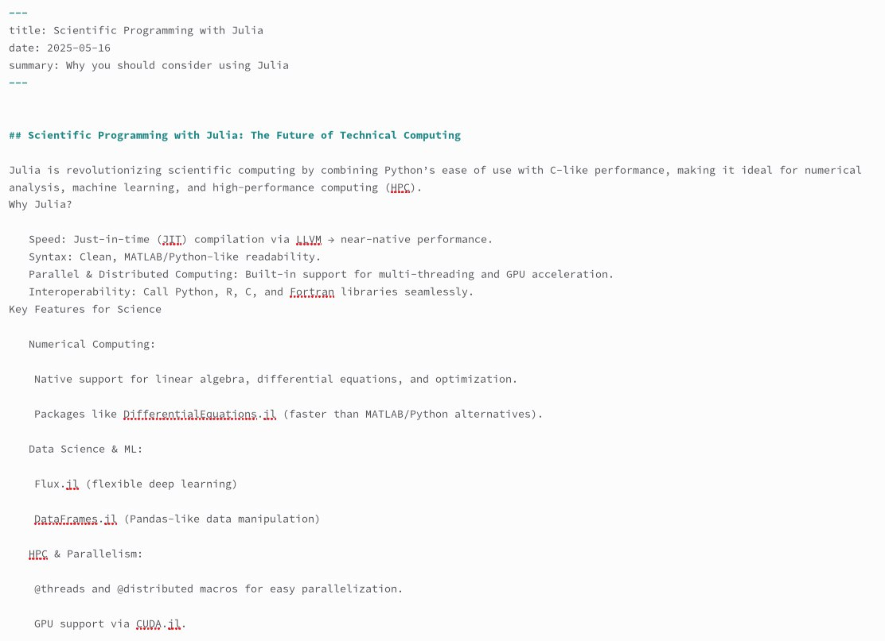
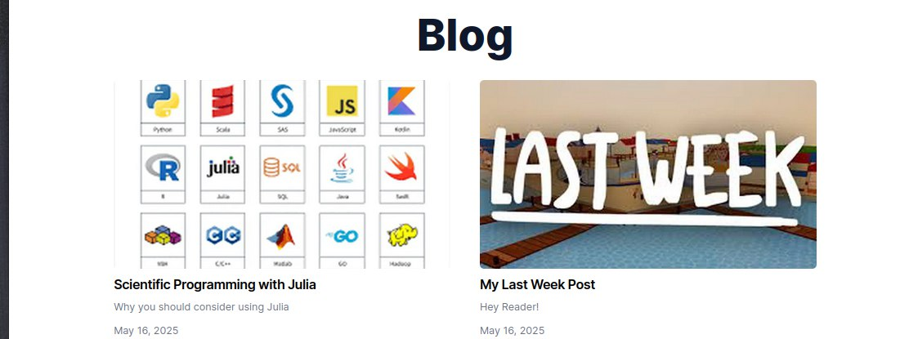
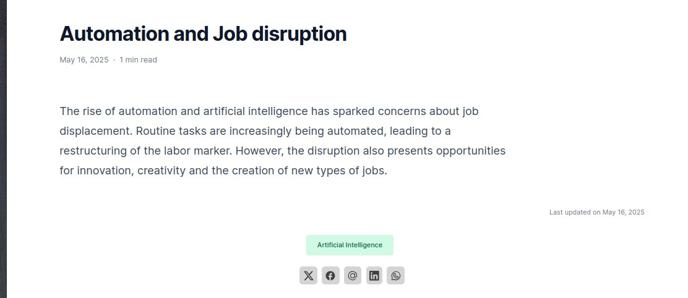

---
## Front matter
lang: ru-RU
title: Презентация по индивидуальному проекту
subtitle: Этап 5
author:
  - Джаллох Ишмаил
institute:
  - Российский университет дружбы народов, Москва, Россия
date: 16 мая 2025

## i18n babel
babel-lang: russian
babel-otherlangs: english

## Formatting pdf
toc: false
toc-title: Содержание
slide_level: 2
aspectratio: 169
section-titles: true
theme: metropolis
header-includes:
 - \metroset{progressbar=frametitle,sectionpage=progressbar,numbering=fraction}
 - '\makeatletter'
 - '\beamer@ignorenonframefalse'
 - '\makeatother'
---

# Информация

## Докладчик

:::::::::::::: {.columns align=center}
::: {.column width="70%"}

  * Джаллох Ишмаил
  * НКА 05-24
  * Факультет физико-математических и естественных наук
  * Российский университет дружбы народов
  * [1032239614@rudn.ru](mailto:1032239614@rudn.ru)
  * <https://Isho-Jah.github.io/ru/>

:::
::::::::::::::

# Цель работы

Отредактировать сайт.

# Выполнение работы

## Добавить проект

Перешел в каталоге AI and job disruption, вставил фотографию featured.png и создал index.md. Написал некоторый текст в этом файле и сохранил изменения:

{#fig:002 width=70%}

## Добавить проект
## Добавить пост по прошедшей неделе

Перешла в ~/blog/content/post и создал новый каталог. В нем вставил фотографию featured.png и создал index.md. В написал о неделе и сохранил изменения:

{#fig:004 width=70%}

## Добавить пост на тему по выбору

Создал еще один новый каталог и в нем вставил контент о научном языке программирования Julia:

{#fig:005 width=70%}

## проверка сохранения изменений

Далее сохранил изменения и проеверил все на локальном сервере. После этого я перенесл все изменения в репозиторий на гит:

{#fig:006 width=70%}

## проверка сохранения изменений

{#fig:007 width=70%}

# Выводы

При выполнении данной работы я отредактировал сайт.
